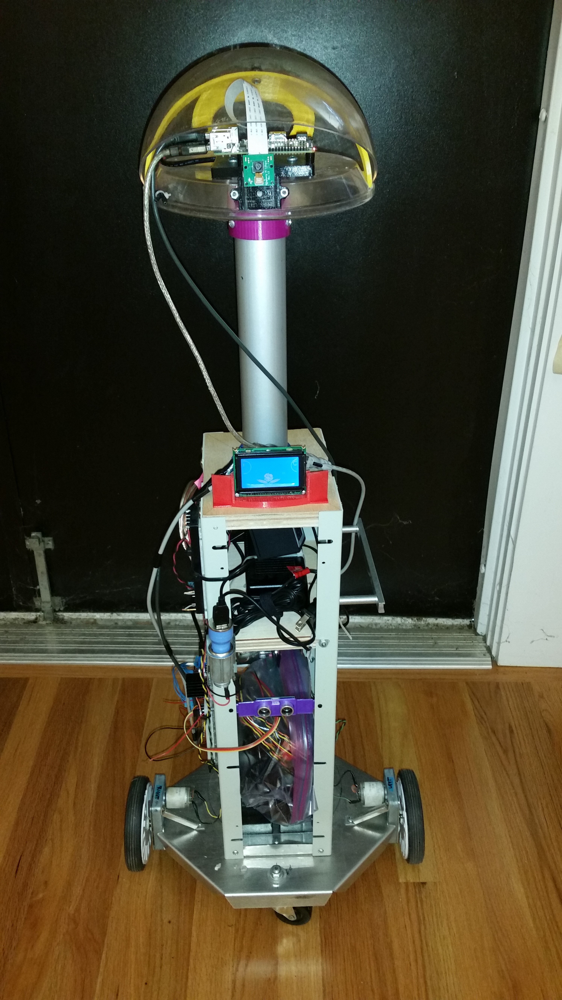
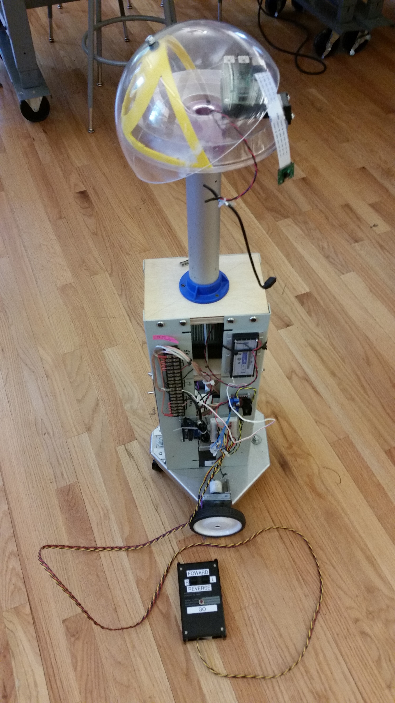
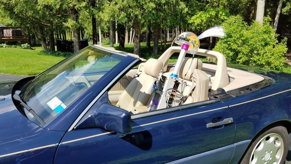
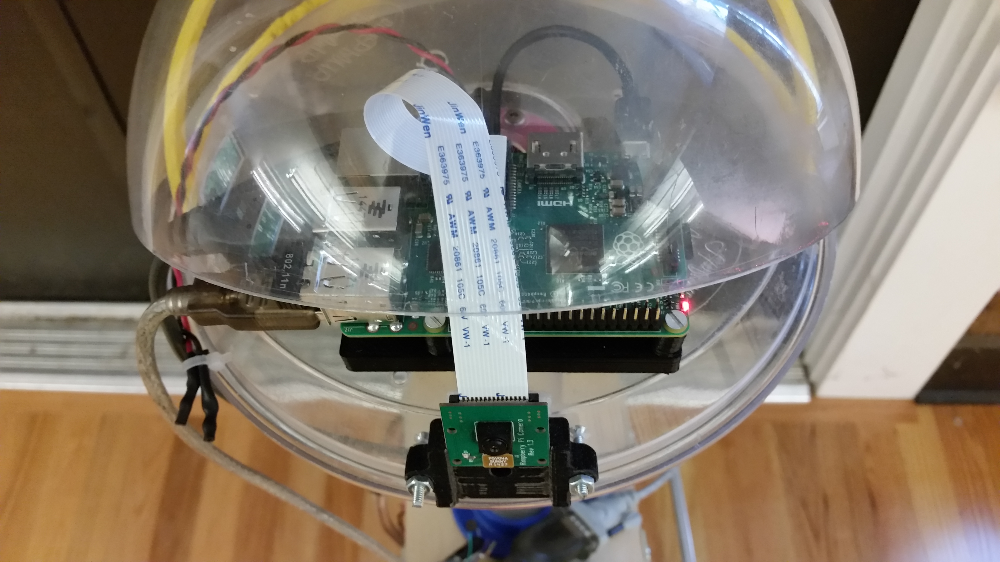
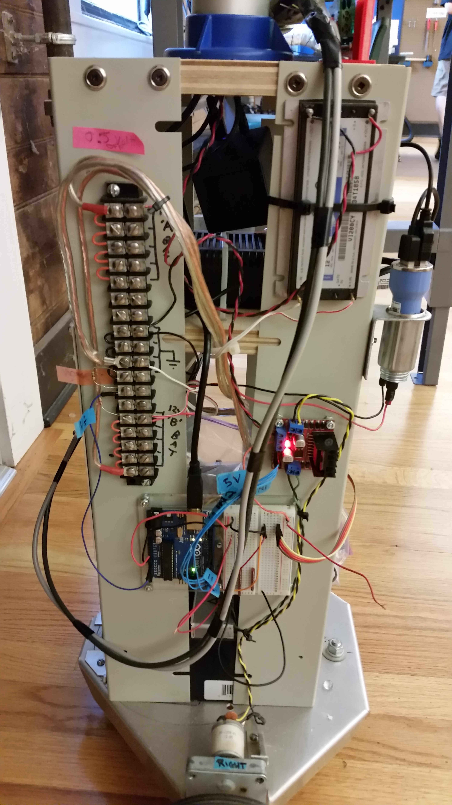
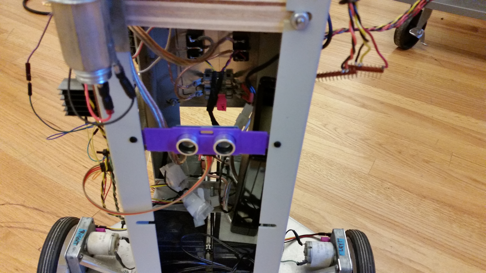
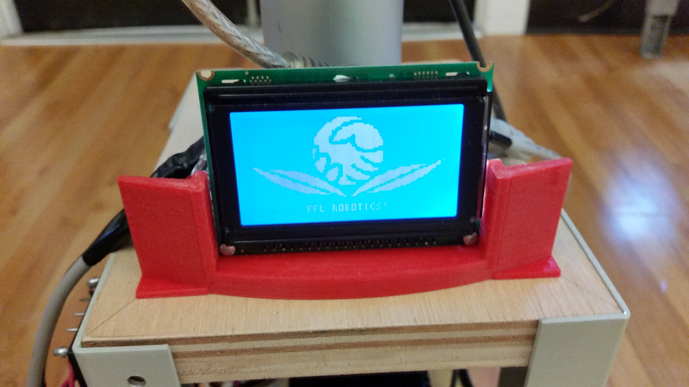

# Dewey

If not already up to date, to get the latest dewey code
```
git pull
```

To push everything to the repository (DO NOT PUSH OR ADD IF THERE ARE ERRORS)
```
git add .    - This adds all changed files in the directory recursively 
use git add . -v   If you want to see the files that will be added (verbose mode)
OR git add <filename with path if necessary>  this will add just the file you specify
git commit -m "Your message here"
git push
```


## Fayetteville Free Library Robot Club - Dewey

Location of Dewey Code
https://github.com/jwilliams506/Dewey 


# Photos

The Robot (Dewey)


Dewey - The old Photo


Dewey Out For A Drive

 
Dewey - Raspberry Pi - The Brain


 
The Robot Electronics - The Motion Control, Sonar Sensor, Voltage Measurement, etc


 
Dewey Photo of Sonar Sensor



 Dewey Photo of GLCD Display - With Library Logo
 


## Reminders
- Dewey Ethernet IP address is  192.168.1.199
- Dewey FFlAir WiFi Static IP address is  10.100.1.199 - Subject to change. 
The Library has put things back for a little while until they figure out the routing that they want.  
The old addres, above, will work until they do. 
- VNC connection is either of the above IP addresses and port :5901, depending on the link used.
- Dewey Password - email or message Ken Samuelson - See meetup for my contact info. 
- Watch handling the Pi.  If you're not careful you will pop out the spring loaded microSD card and you will trash the card.  This is very bad. 
- Robot club has a keyboard and mouse in the containers. If you can't access Dewey, you will need the keyboard, mouse, and an HDMI monitor, cable or HDMI to VGA converter. See Ken Samuelson I have all (any) of them.
- The Fayetteville Free library is closed Sunday's in July and August and only open 10-1 on Saturday.  Reminder if you are planning to work on Dewey.  
- Pull and push Git code always and often so you don't lose any of your changes.  If you need git training see Ken Samuelson 
- All changes must be documented here or they will be removed unless or until validated.  
- You can remote into Dewey using an SSH client like Putty at the IP address above
- You can FTP into Dewey at an IP address above. Anonymous gets you limited file access.  SCP gets you fill directory access. 
- If Dewey crashes for some reason and the terminal window gets messed up (i.e. you can't see what you are typing) then use the command type> reset   in the terminal and it will fix the terminal display.
- Power off to Charge the Batteries. Dewey's batteries are not charged while switches are up.  This may or may not be a good things but is the way it is.  

## Running Dewey 
1. Logon to Pi locally or through VNC
2. open a terminal window
3. Type> cd     - this step gets you to the /home/pi directory
4. type> cd dewey  OR skip step 3 and just type> cd /home/pi/dewey
5. type> sudo python3 python/sendSerialDewey.py 
- DO NOT USE type> sudo python python/sendSerialDewey.py 
- This does not work with the GLCD functions.  Dewey should work with both versions
6. Enter a command to control Dewey 
- Remember don't hit enter just the key.
- Type H if you forget the available commands.
7. When finished hit X or ESC.  This stops running the python program

## Shutting Down Dewey Cleanly 
- Make sure to power off Dewey each night cleanly - 
- Type> sudo shutdown -h now OR go to the menu shutdown and type the password. 
- Turn off the speaker before shutting Dewey down so that you won't wear down the batteries.  
- Turn off both power switches ONLY after a clean shutdown.


## Current Task List 
- [X] Get Motor run working without delay() code
- [X] Dewey needs a re-charge.  Batteries were at 11.98VDC - Plug in for a day
- [ ] Put Drive.c Back into MotorRun and figure out why it is not compiling
- [X] Get sendSerialDewey.py working with python3 
- [X] Get GLCD working with when python3 is available. GLCD only works with python3
- [ ] Setup a DHCP server on the Ethernet port for automatic connecting via Ethernet Cable
- [X] Fix image program to not overwrite images but figure out what the next image number is and store that number.
- [ ] Find out why the camera turns on and stays on through the whole running of sendSerialDewey.py
- [ ] Rename sendSerialDewey.py to Dewey.py.  Clean up git code
- [ ] Remove all test and demonstration code that is not used. 
- [ ] Get autonomous mode working. Dewey drives around by itself. 
- [ ] Add voice files for "Hello, I'm Dewey", "Excuse Me", "What is your Name?", "Can I take your picture?", "Say Cheese!","Bye, Bye - Dewey Sleeping now",etc.
- [ ] Should do a sudo apt-get upgrade. Possibly will break some things so need to be careful when we want to do this. Test on home Pi setup first, before library setup. 
- [ ] Get Dewey Video working
- [ ] Add Microphone to Dewey
- [ ] Get Dewey voice recognition working
- [ ] Figure out how to break this file into multiple files.  It is getting too long.
- [ ] Fix rogue carrige returns from Arduino.
- [X] Fixed Dewey so that if Arduino serial port is not working then the program exits gracefully 
- [ ] Fix GLCD need for absolute path 


## Wish List 
- Wiring 5V supply to the breadboard and better wiring in general.
- Incorporate encoders and perform testing
- Incorporate Heading (possibly acceleration) and see if Dewey can track straight and make better 90 degree turns . 
- Arduino code - Work on wheel tracking via heading. Incorporate code into baseline.
- Arduino code - Work on Sonar sensor (probably wiring)
- If any of the stuff I requested comes in work on that (eyes, LED string)
- Create an updated Schematic of Dewey. Store on Git
- Figure out Flask code and implement in Dewey
- Speed/PID control on drive motors
- Streaming video via web interface
- Real-time robot control via web interface
- Integrated display - GLCD  - DONE
- Collision detection (contact/skirt)
- Collision avoidance (non-contact/Kinect/ultrasonics/laser)
- Floor/stair detection
- Navigation (compass/GPS/SLAM/inertial/encoders)
- VR interface
- Alexa/voice recognition
- Closer integration with library services (book look-up/database)
- Facial recognition
- Person tracking/following

And perhaps most importantly:
- Super rad lighting effects - LED string (Cylon)

## Implemented Functions
Too many to list - Volunteers to document?

## New Discussions - only on github

## Dewey Day July 3, 2017 Ken Samuelson 
- minor fixes to get python updates (image) working on robot.
- Updated sendSerialDewey.py to use both python (2) and python3.   
Any Dewey Testing always needs to include both python and python3 
- Continue to update and fix README.md
- Noticed some stray carrige returns and formatting problems coming back from arduino
Added to the task list.
- Got GLCD working inside the dewey program
- GLCD FFL Logo pops up first on program run.
- GLCD circles, Text and small logo pops up on hitting I key
- Created functions for showing each type of GLCD picture
- Cleaned up all comments and got rid of ncurses and pygame non-blocking functions
- Moved all functions to the top
- Moved settings below functions and in front of code. 
- Tested and fixed to work with python2 by disabling the GLCD when using python (2)


## Dewey Day July 1, 2017 Ken Samuelson 
- Updated sendSerialDewey.py to include Help Menu, Talk, Picture capability
Talk works for both aplay and mpg123 files when files are in the sounds directory.  The alsa and .wav files do not seem to work yet.
Tested on Dewey and the images, help menu and Sound works. 
Fixed Motor Run code to compile and be downloaded to the Arduino.  Drive.c was removed because it would not allow compiling. 
Autonomous mode is compiled in but may or may not work.  Still needs testing

Working on:
1. Getting sendSerialDewey.py to run on Python3  - so GLCD code can be added. 
2. Clean up some carriage returns and text formatting for cleaner debug output
3. Would like a debug mode so the screen stays clean unless needed
4. Done - Fix motor run to not use any delays but use millis. Better multi-Tasking


## Dewey Day June 30, 2017 Ken Samuelson 
The library changed their WiFi so I was not able to log into when I first arrived Dewey today.  I setup a static IP address on the Ethernet port so that you can directly connect to Dewey for VNC and programming.  The Ethernet port is now setup static at 192.168.1.199.  Set your computer to 192.168.1.xx where xx is anything but 199.  I set my computer to 192.168.1.50 and directly connected Ethernet cable to be able to work. Apparently one of the ports switches the wires so that it acts as a crossover Ethernedt cable.  Your mileage may vary.  
This took quite a bit of time to debug and fix so I didn't get too much done.
Suggest Dewey be setup as a DHCP server so that whent he computer is connected Dewey provides the IP address.  

With the change to the WiFi the Date on Dewey is now being updated from the Internet so you don't need to update the date everytime you come in.  
We do need a static library IP address.  I talked to the library tech supprot about gettign a static IP address for Dewey.  
Hopefully they are working on it. 

What I did fix:
- Added help menu when you hit H to sendSerialDewey.py - See Git update
- Added Picture capability when you hit P to sendSerialDewey.py - See Git update
- Got the SketchBook motorRun Program working. The problem was the Drive.c program and autonomous mode function prototype which was causing compile errors.  
The drive.c program was not needed at this time.  I think John added that in.  We need to work on it to see what's wrong with the compiling.  


# Past Discussions
Below is basically the Discussion Messages from the CNY Makers Meetup Discussion board. 
I'm not sure if the Discusison capability of Meetup will remain, like they removed the files upload section.  Therefore I copies all the discussion messages here so all the data could be kept in one place. (Some content of the messages have been remove dif it wasn't relevant to the buld, running, test or oepration of Dewey )
https://www.meetup.com/CNY-Makers-Meetup/messages/boards/ 

## Dewey Day June 25, 2017 Ken Samuelson 
My plan is to integrate all the Dewey code to Git. Work on getting the Photo, audio and LCD screen code into the baseline. If John shows up we may work on getting the compass device working on the Arduino.

I cleaned up the Dewey python directory removing all the interim builds. I tested it to show that it all works. I also put the GLCD directory in the python directory so when we get there it is ready to be built into the Dewey baseline. I figured out the python camera program that we can add on Thursday. It is all in your Git and updated now.

Thursday goal:

Clean up root directories of all non-used code.
Python code - Get Camera working when you press P (Picture) key
Python code - Get LCD display working when you press I (Interface)
Python code - Get Audio working when you press T key (Talk). Starting to run out of Alphabet. H should be help menu.
Wiring 5V supply to the breadboard and better wiring in general.
Arduino code - Work on wheel tracking via heading. Incorporate code into baseline.
Arduino code - Work on Sonar sensor (probably wiring)
If any of the stuff I requested comes in work on that (eyes, LED string)


It seemed that the communications link between Dewey and VNC was laggy. Commands took a while to react.

The board that Joe gave me looks like a navigation (heading) board using SPI. I’m going to try to get it running on one of my Arduinos this week. If it works we should use it, at a minimum test it.

We can also figure out what Bob Lawler’s Flask code does and see if we want to use it. It seems to have a web server and other useful stuff. Possibly Flask will help us remove the alphabet problem. 


## Dewey Tasks for Electronics Club 10/17
Some of this was entered in the Electronics club site.
Hopefully I'll be able to make it next week. If you're not on both of these lists I suggest you join.
We need :


    USB powered speakers - we can work on Dewey's voice.
    If Joe remembers to bring the optical sensors and we can figure out how to wire them up and program them
    If someone wants to work on how to make the wheel encoder work that would be a good task.
    Someone could work on how to get the camera to sense movement. There are some cool image libraries (python) out there.
    Someone could work on getting the second battery voltage connected to the Arduino and implement the voltage measurement software on the Arduino.
    I would be willing to donate my Real-Tiem Clock (RTC) to keep Dewey's time and Date updated (since we can't figure out how to get NTP to work)
    Get NTP to work


Other ideas? Please post them below. 
### jwilliams
Also, if we had an accelerometer we could create a PID controller instead of using the wheel encoder to balance out the torque. We just need to find out base coordinates in relation to world coordinates to calculate error, which could be calculated with an accelerometer on the delta change in values (only one of x, y, or z since his movement is technically 2D).

### Adam S. 
# I would also be interested in working #7. Get NTP to work. I found a post here: (sorry link broke when copying.  See origional discussion in CNY Maker Meetup)


Mentioning using openntpd instead of ntp (both located in the repos), due to routers restricting ntp using port 123. There are some other suggestions as well.

Does Dewey live at the FFL, or does he go home with someone? I don't have a nnnnPi yet, but am working on that part. I will bring a list of things to try to the next meeting I can attend, if no one has solved this yet (it would also be useful to hear what has already been done).

8. Dewey Docs - I would be interested in working on some documentation describing various parts of Dewey, if it hasn't been done yet. It would provide a location to describe plans for Dewey, keeping everyone on the same page. I'm thinking simple over complex. Basic block diagrams, flowcharts, descriptions, pictures of sketches on napkins...just enough to describe the overall architecture and goal, as well as leave spots for details if desired.

Hey Adam, I currently have all Dewey's source code (python, c, and arduino) under my github account. I am in the process of refactoring all of it and cleaning it up right now and will make sure everyone has access soon. Dewey also usually sits behind the desk in the fab lab. Also, documentation would be great, we could talk about it when we meet up at the library. 

## Sonar Sensor Update September 10, 2016
I have implemented the sonar sensor code into the Arduino Motor code. I have changed the version to Motor_v10a. The sensor is working and if the sensor reading is greater than 0 then it will send a serial text printout to the Pi. A few caveats:
- It does not stop the wheels, yet, if it is getting close to something. That will be the next revision.
- I rewired it to use port 2 and 4, for trigger and echo respectively.
- I set it up so that a sonar sensor could be swapped out and plugged into the breadboard in case we needed to use it for testing.
- I removed the 12 VDC input to the Arduino so that it is receiving it's power only from the USB connector. It seems the power input and the USB connector power were somehow fighting each other and not allowing the sonar sensor to function. The black cable has been covered with black tape and stuffed into the inner frame of Dewey. It should probably be removed or reinstalled when we figured out what is wrong.
- I also left sensor sketch on Dewey for isolated sonar testing
- Sonar sketch and Sonar1 sketch may or may not be working. 

## Play day September 1, 2016 - Time / Recharge
Stopped by the library tonight to play around.

I was working on the date issue and it appears that NTP uses port 123 both up and downstream. This means that we probably can't get accurate time though NTP. More to be investigated.
If you want to set time manually use the command:
sudo date -s '2016-09-01 18:05:00'
An alternate command is:
sudo date -s "2 Sept 2016 18:09:10"
This will at least get you to a current date/ time so that you can get the right packages.

I also disabled and uninstalled NTP and installed OpenNTP to see if this would help. OpenNTP is suppose to use high port numbers that routers do not disable. This is running but does not appear to be working either.

I also was running Dewey and the Voltage Monitor came up as 5.8 volts. Confused as to why it would be so low I put the volt meter on the electronics bus and it was truly 5.8 volts. I plugged Dewey into the wall to get a recharge, but we need to watch this. We don't want the electronics to get shutdown while someone is working on either board. The motor voltage was still at 12 volts.

I may try to work on the PI Sonar sensor while I am here. 

## Dewey Backup and How to Set Time
I have created a micro-USB card dewey backup as of today.

I did it using a MicroUSB adapter. It worked pretty good. I purchased a micro-USB to standard USB A adapter. I put it in the USB port and I used the Menu option Accessories SD Card Copier.

Selecting the correct card and hitting ok worked well. It took about 20minutes but it didn't seem to care that I used a 16 GB card and Dewey's card is 32 GB. I then powered Dewey down and replaced the card and it booted and ran perfectly on the new card. if anyone wants a copy of Dewey's card bring a MicroSD card with you next time and you can get a copy.

FYI the adapter device that I used came from China (from Amazon). I found it here.
ABC® MINI 5Gbps Super Speed USB 3.0+OTG Micro SD/SDXC TF Card Reader Adapter
Link broken see origional CNY Makers Meetup Discussion)

I also figured out if the date is wrong you can use the command
sudo rdate time.nist.gov
to get it corrected.
I'm still not sure why it doesn't check on bootup but this command works. 

## Work Days August 13, 17, 18 2016
The new Arduino and Python code have been loaded on Dewey.

We were able to get a second VNC session running with the first one by just having the first session type in the command tightvncserver.
this sets up a vncserver :2
To attach to this server use the VNC client setup
10.100.1.199:5902
This session should not be running all the time. It needs to be started when multiple users what to use Dewey at the same time.

Arduino - I entered forward and backward wheel compensations values into the code. 5 seems to work at the slow speed but it needs a high number at a higher speed which makes sense. it may not be worth pursuing static compensation at this time. Also the backward compensation is different t=from the forward which can be problematic. Dynamic updates via sensor could work better. This code would need to be explored and the encoders setup.

John has been working on the Python code for controlling Dewey. He now has a program called DeweyUI.py that uses a library called serialInputs.py. It is currently working to control Dewey without locking up the keyboard in a blocking mode. Thanks John.

Emory has created a 3D print of a Sonor Sensor holder that we installed on the front of Dewey. Thanks Emory. The wiring is tied to the Arduino at Power Ground and Trigger Pin 2 and Echo at Pin 4. No code has been written to get the Sonor working on Dewey yet. A picture will be uploaded to the files area when I get a chance.

The Electronics Voltage reading at Analog Pin 0 on the Arduino is working pretty good. The voltage reading is off by a few tenths of volts but it is close. I was reading 12.11 on the volt meter and the sensor was giving between 12.0 and 12.2. It will be interesting to see if we can monitor the voltage and tell when the batteries need to be charged.
The battery voltage reading is being sampled about every 5 seconds and sent over the serial interface asynchronously. Also it is only a single sample, but a better way to do it might be to sample 4-10 times then send back the reading. I have set the Arduino up using a Case Statement so that we can add other voltage reading for the Motors and anything else as well. The wiring for the Motor Voltage reading has not been setup. the latest Arduino program sketch is MotorRun_v9h

As a side note the voltage reading is a simple voltage divider from 12 down to about 2.6 volts using a 2.2K resistor at the 12V end and a 560 ohm resistor to GND. These were the only resistors we had. This gives about a 4mA current to the input which is good and low.

Note while playing with the voltage divider I did blow the fuse so I went to Home Depot and got some new 5 Amp fuses. There are 2 taped to the inside of Dewey in case this happens again and also 1 taped to the divided supply box as spares. Be careful not to remove any of the voltage divider wires without first powering down. I'm not sure if Dewey can handle 12 V if the GND were disconnected first. I'm not going to try it.

I think Bob was working on the NTP client but it is still not working. the time is off by about a week or two. This would be a good next task. PIP would not work correctly without the time begin set correctly. 

## Work Day August 11 2016
We welcomed John to the group. Welcome Jon. Thanks for coming to visit. We hope we see you again.

Bob got the Python PIP function working on the Pi. I believe he did this by just changing the date on the Pi. We should make sure an NTP server is running to keep the correct date. This will be important especially if we are sending and retrieving data/ code to/from GitHub.

Emory got his Pi up and running on the latest version of Raspian.

I didn't do much work but showed John around Dewey and the code we have. He loaded up VNC client and FTP client.

I spent Friday night looking at my Arduino code and after not looking at it for a while saw some simple programmer mistakes. It has been a while since I programmed. They are all fixed now and should be ready for Saturday 8/13. We will be meeting at the library again at 10. the Arduino should be working better than ever and the Python code including the recording function is working well. I also cleaned up some code, comments and created some new functions.
The code should be easier to read and run. Can't wait to try it.

Goals (lofty) for Saturday.
- Test new Dewey code - cleaned up
- Test Drive wheel compensation algorithm (so it tracks straight forward and back )- New code in Arduino
- Get NTP client working on Pi
- Get Bob's web presence and controller working on Dewey.
- Work on the Sonar on the Arduino
- Work on voltage monitor on Arduino
- Play with photos and video
- Work on Speakers and Microphone on Pi
- Get a second VNC session running ( on port 5902) so two people can login and work on Dewey at the same time.
- Backup Dewey - saving an image or everything
Test backup to see that it can be retrieved

I will be putting together a purchase from MCM Electronics so if anyone wants to get in on it let me know. The order will go out on Monday 8/15 it usually comes in within 4 days. 

## accounts, github and email 
Emory Creel
I set up both a gmail and github account for dewey.
github account is fflfablabrobot
gmail account is fflfablabdewey.
I created the gmail account to make the whole system transferable if need be. the github account is under the gmail account.
to get on the github account to post or edit, you will need a github account yourself, then you can be added.
let me know by email, or we can discuss sat if ur there. -e

## Play day August 4, 2016
Hello,

I came to play at the Library today. Good day. Lots of Success.

Dewey is now fully mobile. He can go Forward , Back, Right and Left, Stop, Speed 0-9. The commands are a single ASCII capital character F, B, R, L, S, 0-9. The Python 3 program sendSerialDewey5c.py can operate all the commands. You can also exit with X, which also stops Dewey. You may send capitals or small the python program will "upper" them.

The Arduino program is in sketch MotorRunv8b. It is loaded on the Arduino and active on power up. It is running at 115200 baud.

It would be good to get the Arduino and Python code up on GitHub. Emory suggested he could help with this. I have backups.

I also did an apt-get update and apt-get upgrade. It took a long time to get the upgrade done. Lots of packages to update/ upgrade. It is now done.

I also put on vsftpd so that we can transfer files easily. I got through almost all the setting from this page https://pimylifeup.co...­ before I got kicked out of the lab. Will finish next time, possibly Saturday 4/6.

I'd like to get a voltage monitor on the Arduino. It has 5 Analog inputs to use but we need a voltage divider to get the 12VDC down to 5 or 3 volts. Some resistors will work.

It would also be nice to be able to power off Dewey remotely. That way I can work on Dewey remotely (in the library) and shut him down when I'm done. I suggest a power change to a latching button with a relay help in by the Arduino and then released to cut power. Arduino holds power and if monitoring can shut power down before a brown out.

Oh yea, and I took a few picture and video o Dewey moving, both on my phone and from Dewey himself . When I get a chance I will post them. If you are using Dewey and want to take a picture or video just look at the terminal history to find the command that works. Bob said he might be able to help with a Python program to have it active programmatically. Right now you need to change the filename every time. Still not sure how to view the video, possibly it can't be done over vnc server. Bob helped us with this before the rebuild.

I'd like to backup the complete card the next time I'm there in case we ever have problems. I don't want to build this again. It took too long to get where we are. The backup also need to be tested when build. Possibly if we do it on GitHub this can work automatically. 

## Work Day July 16 2016

We made more progress today.
We have the robot motor wires connected to the Arduino. (Updated 7/22/16)

The Motor Right wheel is connected to the Ardunio
Pin 10, White, Counter Clockwise (Reverse) looking at the shaft
Pin 11, Yellow is clockwise (Forward)
Only 1 wire on each side is allowed to be on at a time

The Motor Left wheel is connected to the Ardunio :
Pin 5, White, Clockwise (Reverse) looking at the shaft
Pin 6, Green. Counter Clockwise (Forward)

Using the above information I will be creating a Arduino and Pi code package that allows Dewey to move forward, Back and Turn right and left. The Pi will send the command to the Arduino and the Arduino will execute. If we get a bumper it will be tied to an Arduiino Pin so that the Arduino can stop even if a command is not sent from the Pi. We are also looking at a range finder for the Arduino.

We also used Doctor Monk's software to get the Arduino and Pi communicating over the serial wire USB Type A to USB type B. It was easy once pyserial-2.5.tar.gz (106.3 kB) was installed. The arduino code form this page http://www.doctormonk...­ was installed first then the Pi code was run in Python 2, but Bob says it will work in Python 3. It has not been tried yet.

This is about all I remember but as always if I remember more I will post more. The wire list has been updates as of the date listed above. 

Bob L. 
In the future, I recommend we install Python modules through pip (Python's "Preferred Installer Program") whenever possible. This will allow Python to manage them in a similar manner to apt-get and negate the need for us to manually keep track of where each version of each module is and keep them up to date.

I feel it's best to explicitly specify which version of Python a module should be installed for, since Python 2.7.x and Python 3+ coexist on the Raspberry Pi. For example, to install pySerial for Python 3+, this command can be used:

python3 -m pip install pyserial

However, to install pySerial into the default version of Python (typically 2.7.x), this shortcut command may be used:

pip install pyserial

### Ken S. 
When I tried the above python3 command on my home Pi it said:
Requirement already satisfied (use --upgrade to upgrade): pyserial in / usr/lib/python3/dist-packages.
Cleaning up....

I'm not sure where the --upgrade goes so if you can tell me I will try it and see if I have the latest then we can do this on the FFL Pi as well.

It would be nice if we also had a command to test what version we have running/ installed.

As of last month, pySerial is now at version 3.1.1. Version 3.0 (released several years after Monk's tutorial) added support for Python 3.2+, so updating pySerial should provide compatibility with Python 3.

### Bob. L. 
For python 3, this command seems to work on my machine:

pip3 show pyserial

I'm currently running version 3.1, which is installed under Python 3. To check packages installed for Python 2.7, use "pip" instead of "pip3." Replace "pyserial" with another module name to check its version.

I've also been playing around with virtual environments for Python to keep things straight between modules and dependencies. If we run into a conflict, I think we can just spin up a new virtual environment and install compatible modules. It seems like the Python gurus out there recommend always working in a virtual environment to avoid such issues.

EDIT: To actually answer your question, though, I think the command is:

python3 -m pip install pyserial --upgrade

or (for short): pip3 install pyserial -U


### Ken S.
I ran the pip install command on Dewey this morning and came up with the same response as on my home Pi.

pip3 show pyserial on dewey this morning and received this response.
...
Name: pyserial
Version: 2.6
Location: /usr/lib/python3/dist-packages
Requires:


Not sure what to do next. Afraid to do upgrade or update unless we are sure of the command.

By the way I also got a USB micro cable from Mike C. he said we could keep it.

I worked on the drive code. I'm changing it to a class but my syntax is not correct. I should have it by Thursday.
I hope Mike D. can get the 12 VDC plug working. I'm tired of chasing cables every time I get here. 

### Bob L. 
I wish I'd known you were going in today :(

I've been working on a Python web server interface for Dewey that I think it almost ready to deploy. So far, on my netbook, I can:
- Stream video from my webcam to multiple clients (on the local network)
- Receive messages from the server and update in the client
- Use a graphical control to send movement commands from the client to the server

As it's based in Python (apart from the Javascript and HTML elements), it should interface directly with the drive code you're working on. Unfortunately, I don't have a Pi to test it on, so there will likely be some incompatibilities when installed on Dewey. The tutorials I've followed were originally written for the Pi, though, so we should be able to get it up and running.

However, it looks like I won't be in town Thursday, so I likely won't be able to make our meeting. Please let me know if anyone plans to come in the following Saturday - I should be able to make it then.

## Meeting July 14 2016
Tonights meeting was great we accomplished many things. Mike mappe d out the Arduino pinouts for the two motors. He proposed using 4 PWM outputs. Pins 5,6 and 10,11. He may have suggested which direction but I neglected to write it down.

We installed a USB type A to Type B cable between the Arduino and Pi. We also installed the Arduino programming software on the Pi and changed the Blinky code to a 5 second on and 1/2 second off. The command to add the Arduino programming code to the Pi was:
sudo apt-get update
Then
sudo apt-get install arduino

These instructions came from: Serial communication Aurduino to Pi
http://www.doctormonk...­
part 2 servoPi to aurdino serial over USB
http://www.doctormonk...­

Mike also suggested that we use a 12 VDC adapter plug and a 12VDC to USB adapter and then a USB cable from USB Type A Male to Mini B Male Cable . This cable will be routed up through the neck of Dewey.

This is all I remember but as always, and as I now know, I can update this post if i think of something new. 

## Work Day June 25 2016 vncserver
Just wanted to update everyone on what we learned and did on June 25th.

What we did:
- Reinstalled Dewey Raspberry Pi - to fix the VNC mistake we made.
- Setup Dewey as a VNC server
- Set Dewey IP address static as 10.100.1.199 (use port 5901 to connect)
- Tried to take pictures and capture video using these instructions https://www.raspberry...­ but couldn't get it to work. Attempted to do it via Python. We should have used the instructions here: https://www.raspberry...­ OR the instructions Bob L. used. They worked previously.
VNC needs the command: 10.100.1.199 : 5901 to run

The instructions for setting up VNC are here, so they don't get lost:
I used VNC though the Google Chrome browser. You install the VNC add in.
Type
sudo ifconfig < check the IP address>
netstat -r < find the gateway and write it down>
sudo nano /etc/network/interfaces < I will put a copy of the file in the files area for posterity>
Save file | reboot and address will be static
Installing VNC on Dewey
sudo apt-get install tightvncserver
Hit Continue and type in a password - <message me for the password if you don't have it.>
We did not put in a view only password

To make VNC server run on boot:
We used the exercise files from Lynda.com- the file will be put in the files area. We copied the file to the init.d directly and made it executable
To install it change directory to the exercises directory (it was on desktop for us). From that directory type:
sudo cp /usr/bin/tightvncserver /etc/init.d
sudo chmod a+x /etc/init.d/tightvncserver
sudo update-rc.d tightvncserver defaults (this line updates the rc.d file so that vnc server will run.
Reboot and it should work and initialize on startup.

Emory was there on Saturday. He gave us the link to the former Google Site (although there is nothing there) : It is located here: https://sites.google....­
you must have a gmail address and you can be invited to be in the group. Message me or email me (with your gmail address ONLY) and I will add you to the invite list.

I think that is all I remember about the morning. Again lots of good work was done and Anthony got the LCD touchscreen working on a ArduinoUno (not his Arduino Mega... yet). I will add more as a reply if I think of anything. 

other Camera instructions to try:
https://www.raspberry...­
OR
https://www.raspberry...­ 

Sorry I ended up not being able to make it!

Your second set of URLs for camera usage is what I was using (both available from here: https://www.raspberry...­) - specifically, I was using the shell commands. I haven't poked around yet at what version of Python is included on the Pi, but it shouldn't take much to get the camera running via code.


I ended up hosing up my personal Pi usign the command:
sudo tightvncserver. DO NOT DO THIS!!!!
After entering this command it puts up a password on Boot that you can't get out of OR at least I can't figure out how to get out of it.
There are simpler VNC instructions here: https://learn.adafrui...­
I will also put the pdf file of these instructions in the files area.

Incidentally these instructions did not work for me. I sent back to Lynda and found my flaw (below) and now things work correctly again.

I found my major flaw with this. I forgot, one line, to update the rc.d file. To do that type :
sudo update-rc.d tightvncserver defaults
You will get warnings but do not worry about them. I found I could update the above post so I include the line so you don't need to look down here to get the answer. I will leave this in the discussion anyway since it is important.

One last thing. If you ever want to disable vncserver from running type:
sudo update-rc.d tightvncserver remove

As a note, Dewey's static IP address is 10.100.1.199:5901 (this is updated from Ken's post above with the correct port).

## Work Day June 18 2016

Folks,
Bob L and I worked on the Raspberry Pi on June 18th. This is what we did, what we learned, and what I think we need. I think we accomplished many good things. I can't wait to show you all. Thank you Bob for the assistance. If I think of anything more I will add it to a reply.
Bob, please read this over and see if you have anything to add.
All, add questions to the discussion if you like. Please participate.

1) We were able to plug the Pi into the overhead projector with HDMI. It worked okay but was hard to read. I brought a USB keyboard and Mouse (and monitor just in case).
2) We were able to install Raspian via NOOBS. We will tell you how we did it or show you the next time we are together.
3) We were able to setup the VNC server and get a VNC connection to the FFLAir network even though Dewey is still on a Dynamic IP address.
4) We were able to run headless with the VNC connection.
5) We were able to take a picture and video with the camera. We could not view the video since it was in H264 format (not sure what that is)
6) I personally have a microSD card and adapter with the Raspian Operating System installed.

Things we learned.
- The micro USB connector has been bent but if dealt with carefully it will work for the time being. It needs to be repaired or replaced soon. In its current configuration a right angle connector would be better. Possibly we should move the Pi location.
- A phone charger with a microUSB connection might work if run headless but if all functions and connectors are being used it draws too much current and causes flaky operation and reboots.
- Possibly a USB cable/ plug that can be plugged into the wall will work. The Lynda .com instructor says you need 1.5 to 2.5 Amp capability. Most computers and chargers might be less than that. I don't suggest you ever plug the Dewey Pi into your computer port unless you don't care that it might be destroyed.
- Only the "B" switch turns on the Pi. Possibly the "A" switch only turns on the Arduino?
- The VNC connection needs a port of 5901 at the end of the IP to get it working.
- We setup a VNC password that we will give you if you need it. It is simple
- The Lynda.com "Up and Running with Raspberry Pi" is really good and worth watching. Follow those instructions if you want to get your own microUSB card setup.
- You can plug in a USB stick to the port to transfer files. I'm still not sure how to eject or disable the stick for safe removal under Raspian. Can someone help?

Things we need to do or get established:
- Repair of the microUSB power connector - pinouts of the connector would also be helpful.
- Static IP address, on the library FFLAir network, for Dewey for VNC connection. Who do we need to talk to about this?
- Place to keep passwords or working notes on Dewey. So if things get changed everyone knows where to go to get the answers. Possibly here in discussions.
- If you want to have your own copy of the Raspian operating system bring in a microSD card of 8GB or larger and I will help you get it installed.

Things we should purchase or have on-hand for general use:
1, USB Keyboard (with USB port for the mouse would be best).
1, USB mouse
1, 6 foot (or longer) HDMI cable
1, 8GB Micro SD card - Full Raspian Operating System installed in Dewey
1, 8GB MicroSD card - backup, in case other card is lost stolen or destroyed
Second Raspberry Pi. in case first one gets damaged.
Second Video camera in case first one gets damaged.
A GPIO board for the Pi. Not sure why but it could be used for LED lights (Eyes) and such.
Tactile sensors buttons to activate functions on Dewey. Play a .wav file. Say hello or take a picture, etc..
A powered speaker system (12VDC) with headphone jack to play sounds from Dewey. So Dewey can speak?

Folks,
Bob L and I worked on the Raspberry Pi on June 18th. This is what we did, what we learned, and what I think we need. I think we accomplished many good things. I can't wait to show you all. Thank you Bob for the assistance. If I think of anything more I will add it to a reply.
Bob, please read this over and see if you have anything to add.
All, add questions to the discussion if you like. Please participate.

1) We were able to plug the Pi into the overhead projector with HDMI. It worked okay but was hard to read. I brought a USB keyboard and Mouse (and monitor just in case).
2) We were able to install Raspian via NOOBS. We will tell you how we did it or show you the next time we are together.
3) We were able to setup the VNC server and get a VNC connection to the FFLAir network even though Dewey is still on a Dynamic IP address.
4) We were able to run headless with the VNC connection.
5) We were able to take a picture and video with the camera. We could not view the video since it was in H264 format (not sure what that is)
6) I personally have a microSD card and adapter with the Raspian Operating System installed.

Things we learned.
- The micro USB connector has been bent but if dealt with carefully it will work for the time being. It needs to be repaired or replaced soon. In its current configuration a right angle connector would be better. Possibly we should move the Pi location.
- A phone charger with a microUSB connection might work if run headless but if all functions and connectors are being used it draws too much current and causes flaky operation and reboots.
- Possibly a USB cable/ plug that can be plugged into the wall will work. The Lynda .com instructor says you need 1.5 to 2.5 Amp capability. Most computers and chargers might be less than that. I don't suggest you ever plug the Dewey Pi into your computer port unless you don't care that it might be destroyed.
- Only the "B" switch turns on the Pi. Possibly the "A" switch only turns on the Arduino?
- The VNC connection needs a port of 5901 at the end of the IP to get it working.
- We setup a VNC password that we will give you if you need it. It is simple
- The Lynda.com "Up and Running with Raspberry Pi" is really good and worth watching. Follow those instructions if you want to get your own microUSB card setup.
- You can plug in a USB stick to the port to transfer files. I'm still not sure how to eject or disable the stick for safe removal under Raspian. Can someone help?

Things we need to do or get established:
- Repair of the microUSB power connector - pinouts of the connector would also be helpful.
- Static IP address, on the library FFLAir network, for Dewey for VNC connection. Who do we need to talk to about this?
- Place to keep passwords or working notes on Dewey. So if things get changed everyone knows where to go to get the answers. Possibly here in discussions.
- If you want to have your own copy of the Raspian operating system bring in a microSD card of 8GB or larger and I will help you get it installed.

Things we should purchase or have on-hand for general use:
1, USB Keyboard (with USB port for the mouse would be best).
1, USB mouse
1, 6 foot (or longer) HDMI cable
1, 8GB Micro SD card - Full Raspian Operating System installed in Dewey
1, 8GB MicroSD card - backup, in case other card is lost stolen or destroyed
Second Raspberry Pi. in case first one gets damaged.
Second Video camera in case first one gets damaged.
A GPIO board for the Pi. Not sure why but it could be used for LED lights (Eyes) and such.
Tactile sensors buttons to activate functions on Dewey. Play a .wav file. Say hello or take a picture, etc..
A powered speaker system (12VDC) with headphone jack to play sounds from Dewey. So Dewey can speak?

One problem we had was that after plugging in a USB stick there was no way to safely extract it. The safe extract button is to the far right of the screen. You may have to make the window full screen or move the monitor so you can see the far right corner.
Always safely extract the USB drive if you can.

Come to think of it you should also always shut down Dewey gracefully.
To do this open a command window and type
sudo shutdown -h now <hit enter>


If we plan to start working with Pi GPIO, this might be a good purchase, as it is inexpensive and gives us ready access to the Pi's IO pins from a breadboard:

https://www.adafruit....­

Mike, I believe this is the sort of thing you were looking into as well.

Careful, that doesn't look like it will work directly. It has pins and so does the Pi. I only know this since the overlay that I had fits on the Pins. Anybody have a laminator, or does the library?


The PCB has male pins to interface with a breadboard. The second photo shows the board attached to a Pi via ribbon cable with female connectors to the GPIO pins.

## Dewey - Proposed Features

Hey, all. I've had some time to think about some possible features that could be incorporated into the Dewey robot, and figured I would post them here to spark discussion. These range from the basics to outlandish, but anything goes in brainstorming:

- Speed/PID control on drive motors
- Streaming video via web interface
- Real-time robot control via web interface
- Integrated display
- Collision detection (contact/skirt)
- Collision avoidance (non-contact/Kinect/ultrasonics/laser)
- Floor/stair detection
- Navigation (compass/GPS/SLAM/inertial/encoders)
- VR interface
- Alexa/voice recognition
- Closer integration with library services (book look-up/database)
- Facial recognition
- Person tracking/following

And perhaps most importantly:
- Super rad lighting effects

I have 2 lists running now. They are feature related and separated by device, Pi or Arduino. Some are similar to Bob's. I applaud his broad thinking. I hope we can do those things. I was thinking more down to earth, i.e get a push button working... etc.
I will expound at the next meeting. Then we can post the good ideas here or other common location. 


##Dewey_GLCD Module

For anyone interested, I have uploaded v0.1.1 of the serial LCD Python module. This release exposes all serial LCD commands to Python, as well as adds additional functionality for non-fullscreen images. Please read the included notes file for additional information.

There are still some bugs with text positioning (specifically having to do with wrapping text around the display), but this should be a good starting point. The module is currently hard-coded for Linux, but this can be changed to Windows by simply commenting/uncommenting the appropriate line that defines "ser.port" in _initSerial().


## Rasberry Pi
Folks.
I have located my microSD cards and will be working on getting the OS installed on it.
Things we need (unless we already have them):
- USB Keyboard and mouse - Better if they connect through one port
- Display monitor - Looks like it can be a micro HDMI connector OR an analog TV or display.

Does anyone know if these things are available at the Library?

I will try to stop by the library some evening this week (week ending 6/17) and try to boot the Pi. If you want to attend and have some time let me know and possibly we can coordinate. 

Sorry for the slow reply - I've had to take care of a few things earlier this week. If you're still planning on doing this, I can help out. I don't have a display that will work, but I can probably scrounge up a spare mouse and keyboard. I should also have a micro USB to USB adapter floating around if that helps.

I haven't found a monitor either. I'm checking with the Electronics club at the Library for next Thursday. You can find it here: http://www.meetup.com...­

I'm planning on attending. Possibly I'll see you there. If I find something in the meantime and plan to be at the library I'll post here first. 

I found this cable http://www.newark.com...­ that converts a HDMI connection to a VGA but it is pretty expensive at $28. I say expensive meaning that it is only needed for a few minutes until VNC can be setup. 


Apparently according to the Lynda.com guy you can also use a cable like this http://www.markertek....­ with a Composite monitor input like an old TV. It is only $9. That is more like it. Possibly these are available at Walmart but we still need a monitor that accepts the yellow cable connection. 

I have an HDMI to DVI adapter sitting next to me right now (though I don't remember where it came from, exactly). Might that do it?

I think so. I have a 15" monitor that can accept a DVI. It is much easier to transport than my 32" TV that accepts HDMI.
There is a guy in the FFL electronics club, meets next Thursday (talking about PI and Adrunino), who says the library has a Projector that can accept a HDMI. The only one I saw was on the ceiling and my cable would not be long enough.
If you want to get together this weekend at the library let me know. I'd like to get the Pi OS installed and running. 

## Things that I think need to be done
This meetup was great tonight. WE got to see the robot in it's current form. it runs manually with the control panel see the pictures and video in the files area. I'm told there is a Google Group for this project called fflfablabrobot or ffl_ucontrol_soc but I could not access them.

I think we need:
- A requirements or design document (what the robot is intended to do/ what we would like it to do)
- A parts list
- A schematic
- A place to store code revisions (GIT hub or other version controlled repository)
- A list of who is doing what to what parts
- A list of who has parts and what parts they can donate

As I understand it we have a small budget so we can buy some stuff we need but donations are gladly accepted.

This will get us started.

We can use the voting mechanism on this meetup to vote on new features.

Thanks for allowing me to be a part of this group. i look forward to working on a few things.

It was great meeting everyone, and I think Dewey should be a great platform for some fun projects. If there is interest, I've located my old serial graphic display and would not mind donating it to the cause (since it's only been gathering dust for the last 8 years). It might make for a nice name tag or debug output while the robot is untethered. It's a "ChromaLyte DX300 128x64 Serial Graphic LCD" in case anyone wants to look it up.
